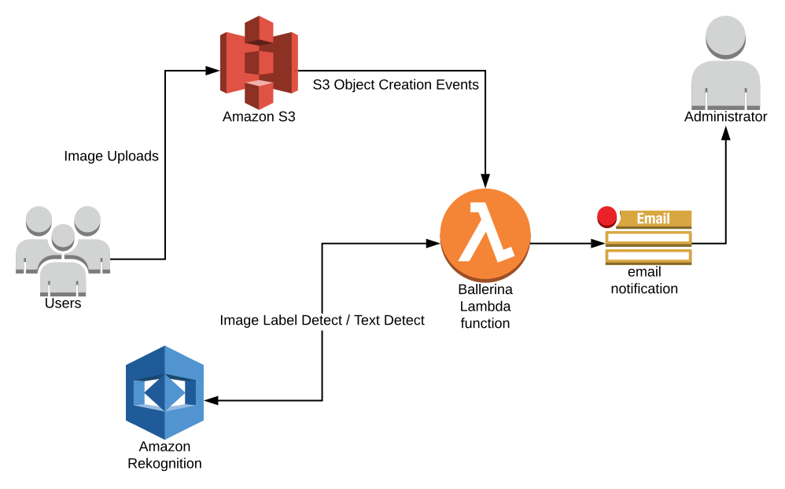

[](https://travis-ci.org/ballerina-guides/ballerina-awslambda-deployment)

# Ballerina AWS Lambda Deployment
[AWS Lambda](https://aws.amazon.com/lambda/) allows you to deploy your code without provisioning or managing servers explicitly. 

With this serverless framework, you pay only for the time your code is running so that there is no money wasted on idling resources. The AWS Lambda functions can be invoked through events that are emitted via various services in AWS such as S3 and SQS. Also, it is possible to invoke them directly using an API, which is exposed through an API gateway.

> In this guide you will learn how to deploy Ballerina functions as AWS Lambda functions.

This guide consists of the below sections.

- [What you will build](#what-you-will-build)
- [Prerequisites](#prerequisites)
- [Implementation](#implementation)
- [Deployment](#deployment)
- [Testing](#testing)
- [Observability](#observability)

## What you’ll build 
In this guide, you will build a Ballerina-based AWS Lambda function, which listens to events from a specific S3 bucket in order to detect new object creations. This bucket is used to upload images via various sources. The job of the Lambda function is to check if the images have any text, and if so, extract the text from the document, and send an email with the extracted text to the administrator. 



## Compatibility
| Ballerina Language Version | 
| -------------------------- | 
| 0.990.3                    |

## Prerequisites
 
- [Ballerina Distribution](https://ballerina.io/learn/getting-started/)
- A Text Editor or an IDE 
> **Tip**: For a better development experience, install one of the following Ballerina IDE plugins: [VSCode](https://marketplace.visualstudio.com/items?itemName=ballerina.ballerina), [IntelliJ IDEA](https://plugins.jetbrains.com/plugin/9520-ballerina)
- An [AWS](https://aws.amazon.com/) account
- AWS CLI Tools (installed and configured)
>**Tip:** For instructions, go to [AWS Documentation].(https://docs.aws.amazon.com/codedeploy/latest/userguide/getting-started-configure-cli.html)

### AWS Access/Secret Key Generation

You need to create an access key / secret key pair for the active AWS account you have.  
For instructions, go to [Managing Access Keys for IAM Users](https://docs.aws.amazon.com/IAM/latest/UserGuide/id_credentials_access-keys.html). 

>**Note:** Copy and keep the access key and the secret key in a secured location. 

### AWS Lambda Role Generation

1. Open the [roles](https://console.aws.amazon.com/iam/home?#/roles) page in the IAM console.
- Select "Create role".
- Create roles with the following properties:
  * Trusted entity - Lambda
  * Permissions - AWSLambdaBasicExecutionRole
  * Role name - lambda-role

### Obtaining Tokens for the GMail Connector

- The steps on how to get access to the tokens can be found in the Gmail connector [documentation](https://central.ballerina.io/wso2/gmail).

## Implementation

As the first step, you can build the basic skeleton that is needed for Ballerina to expose as AWS Lambda functions. Let's name the file `image-text-processor.bal`.

```ballerina
import ballerinax/awslambda;

@awslambda:Function
public function processImages(awslambda:Context ctx, json input) returns json|error {
    return "OK";
}
```

In Ballerina, any function can be exposed as an AWS Lambda function, by annotating a function which has a similar function signature as the above function with `awslambda:Function`. The `awslambda:Context` object contains contextual information on the current execution, such as the request id, tracing information, and the remaining execution time. The payload is passed as a `json` value in the `input` variable, and the function can return a `json` as a response, or else an `error` can be returned to signal an error situation to the Lambda runtime. 

In the next step, you will be updating the code to extract the S3 object information retrieved by the Lambda function. Here, according to the input S3 event payload structure, we have extracted the bucket, object name and the version. 

```ballerina
import ballerina/system;
import ballerinax/awslambda;

@awslambda:Function
public function processImages(awslambda:Context ctx, json input) returns json|error {
   int count = input.Records.length();
   int i = 0;
   while (i < count) {
       string bucket = <string> input.Records[i].s3.bucket.name;
       string name = <string> input.Records[i].s3["object"].key;
       string objVersion = <string> input.Records[i].s3["object"].versionId;
       i = i + 1;
   }
   return "OK";
}
```

The next step is to invoke the Amazon Rekognition service to examine the image for text, and if there is any, extract the text that is there in the image. Here, you can see how the Amazon Rekognition connector is initiazed with the user credentials and the optional Amazon region setting. 

```ballerina
import wso2/amazoncommons;
import wso2/amazonrekn;
import ballerina/system;
import ballerinax/awslambda;

amazonrekn:Configuration config = {
    accessKey: system:getEnv("AMAZON_ACCESS_KEY"),
    secretKey: system:getEnv("AMAZON_SECRET_KEY"),
    region: "us-west-2"
};

amazonrekn:Client reknClient = new(config);

@awslambda:Function
public function processImages(awslambda:Context ctx, json input) returns json|error {
   int count = input.Records.length();
   int i = 0;
   while (i < count) {
       string bucket = <string> input.Records[i].s3.bucket.name;
       string name = <string> input.Records[i].s3["object"].key;
       string objVersion = <string> input.Records[i].s3["object"].versionId;
       amazoncommons:S3Object obj = { bucket: bucket, name: name, objVersion: objVersion };
       amazonrekn:Label[] labels = check reknClient->detectLabels(obj);
       foreach amazonrekn:Label label in labels {
           if (label.name == "Text") {
               string result = check reknClient->detectText(obj);
               break;
           }
       }
       i = i + 1;
   }
   return "OK";
}
```

The final step is to gather up the information and send an email to the administrator if there are any text content in the uploaded images. For this we will be using the Ballerina GMail connector. 

```ballerina
import wso2/amazoncommons;
import wso2/amazonrekn;
import wso2/gmail;
import ballerina/config;
import ballerina/http;
import ballerina/io;
import ballerina/system;
import ballerinax/awslambda;

amazonrekn:Configuration amzreknConfig = {
    accessKey: system:getEnv("AMAZON_ACCESS_KEY"),
    secretKey: system:getEnv("AMAZON_SECRET_KEY"),
    region: "us-west-2"
};

gmail:GmailConfiguration gmailConfig = {
    clientConfig: {
        auth: {
            scheme: http:OAUTH2,
            accessToken: config:getAsString("GMAIL_ACCESSTOKEN"),
            clientId: config:getAsString("GMAIL_CLIENTID"),
            clientSecret: config:getAsString("GMAIL_CLIENTSECRET"),
            refreshToken: config:getAsString("GMAIL_REFRESHTOKEN")
        }
    }
};

amazonrekn:Client reknClient = new(amzreknConfig);
gmail:Client gmailClient = new(gmailConfig);

@awslambda:Function
public function processImages(awslambda:Context ctx, json input) returns json|error {
   int count = input.Records.length();
   int i = 0;
   while (i < count) {
       string bucket = <string> input.Records[i].s3.bucket.name;
       string name = <string> input.Records[i].s3["object"].key;
       string objVersion = <string> input.Records[i].s3["object"].versionId;
       amazoncommons:S3Object obj = { bucket: bucket, name: name, objVersion: objVersion };
       amazonrekn:Label[] labels = check reknClient->detectLabels(obj);
       foreach amazonrekn:Label label in labels {
           if (label.name == "Text") {
               string result = check reknClient->detectText(obj);
               check sendEmail(obj, result);
               break;
           }
       }
       i = i + 1;
   }
   return "OK";
}

public function sendEmail(amazoncommons:S3Object obj, string text) returns error? {
    string id = check string.convert(check json.convert(obj));
    gmail:MessageRequest messageRequest = {};
    messageRequest.recipient = "admin@example.com";
    messageRequest.sender = "admin@example.com";
    messageRequest.subject = "Detected Text in Image at " + id;
    messageRequest.messageBody = text;
    messageRequest.contentType = gmail:TEXT_PLAIN;
    _ = check gmailClient->sendMessage("me", messageRequest);
    io:println("Email sent, image: ", id);
}
```

NOTE: replace the `recipient` and `sender` values in the GMail message request properties accordingly.

Now that we have the full Ballerina code, we can go to the next step in deploying it as an AWS Lambda function. 

## Deployment

### Building the Ballerina Source

```bash
$ ballerina build image-text-processor.bal 
Compiling source
    image-text-processor.bal
Generating executable
    image-text-processor.balx
	@awslambda:Function: processImages

	The Ballerina AWS Lambda layer information can be found at https://ballerina.io/deployment/aws-lambda.

	Run the following commands to deploy each Ballerina AWS Lambda function:
	aws lambda create-function --function-name <FUNCTION_NAME> --zip-file fileb://aws-ballerina-lambda-functions.zip --handler image-text-processor.<FUNCTION_NAME> --runtime provided --role <LAMBDA_ROLE_ARN> --timeout 10 --memory-size 1024
	aws lambda update-function-configuration --function-name <FUNCTION_NAME> --layers <BALLERINA_LAYER_ARN>

	Run the following command to re-deploy an updated Ballerina AWS Lambda function:
	aws lambda update-function-code --function-name <FUNCTION_NAME> --zip-file fileb://aws-ballerina-lambda-functions.zip
```

The above command builds the Ballerina source, and the compiler, via the AWS Lambda extension, injects special functionality needed to execute it as an AWS Lambda function. The output of this is a file named `aws-ballerina-lambda-functions.zip`, which is the artifact that will be submitted to AWS Lambda. In the build process, it prints out the processed list of Lambda functions after the text "@awslambda:Function:"; Here, we only have the function `processImages`. These function names must be used in the placeholder `<FUNCTION_NAME>` in the given commands. Also, another placeholder that we will have to replace would be the `<LAMBDA_ROLE_ARN>`, which is the ARN of the earlier generated role `lambda-role`.

Also, there is another placeholder named `<BALLERINA_LAYER_ARN>`, which is the ARN of the Ballerina runtime layer. There will be a Ballerina runtime layer for each Ballerina release, thus, the specific `<BALLERINA_LAYER_ARN>` should be looked up from the table available at [https://ballerina.io/deployment/aws-lambda](https://ballerina.io/deployment/aws-lambda).

With the above placeholder values at hand, we can start to deploy the function we have developed. This consists of running the `aws lambda create-function` and the `aws lambda update-function-configuration` commands to finish the deployment. Below contains sample build commands for deploying the `processImages` function.

### Deploying to AWS Lambda

```bash
$ aws lambda create-function --function-name processImages --zip-file fileb://aws-ballerina-lambda-functions.zip --handler image-text-processor.processImages --runtime provided --role arn:aws:iam::908363916138:role/lambda-role --timeout 10 --memory-size 1024
{
    "TracingConfig": {
        "Mode": "PassThrough"
    }, 
    "CodeSha256": "lwg8/90iroOzc5fFYU4Fp9r9CpMnsWgx2xOPekldHdA=", 
    "FunctionName": "processImages", 
    "CodeSize": 41462, 
    "RevisionId": "ba962bb9-976e-47f1-9349-cc79319cc30d", 
    "MemorySize": 1024, 
    "FunctionArn": "arn:aws:lambda:us-west-2:908363916138:function:processImages", 
    "Version": "$LATEST", 
    "Role": "arn:aws:iam::908363916138:role/lambda-role", 
    "Timeout": 10, 
    "LastModified": "2019-02-02T00:28:02.658+0000", 
    "Handler": "image-text-processor.processImages", 
    "Runtime": "provided", 
    "Description": ""
}

$ aws lambda update-function-configuration --function-name processImages --layers arn:aws:lambda:us-west-2:908363916138:layer:ballerina-0_990_3-runtime:19
{
    "Layers": [
        {
            "CodeSize": 175675006, 
            "Arn": "arn:aws:lambda:us-west-2:908363916138:layer:ballerina-0_990_3-runtime:19"
        }
    ], 
    "FunctionName": "processImages", 
    "LastModified": "2019-02-02T00:30:55.803+0000", 
    "RevisionId": "7637cae8-703b-489a-87af-ecdae62b1816", 
    "MemorySize": 1024, 
    "Version": "$LATEST", 
    "Role": "arn:aws:iam::908363916138:role/lambda-role", 
    "Timeout": 10, 
    "Runtime": "provided", 
    "TracingConfig": {
        "Mode": "PassThrough"
    }, 
    "CodeSha256": "lwg8/90iroOzc5fFYU4Fp9r9CpMnsWgx2xOPekldHdA=", 
    "Description": "", 
    "CodeSize": 41462, 
    "FunctionArn": "arn:aws:lambda:us-west-2:908363916138:function:processImages", 
    "Handler": "image-text-processor.processImages"
}
```

### Updating Connector Credential Environment Variables

The credentials for the Amazon Rekognize and GMail connectors can be provided by setting environment variables for the target AWS Lambda function. The following command demonstrates this action.

```bash
aws lambda update-function-configuration --function-name processImages --environment "Variables={AMAZON_ACCESS_KEY=AXXXJKKK,AMAZON_SECRET_KEY=/XXXAAAA,GMAIL_CLIENTID=AAAXXXX.apps.googleusercontent.com,GMAIL_CLIENTSECRET=XXXXAAAAXXXXBBBBBBBXXXXX,GMAIL_REFRESHTOKEN=XXXXOFFXXXXX,GMAIL_ACCESSTOKEN=XXXX.XXX}"
```
Fill in the environment variables values with your own API credentials. The above updates can also be done using the AWS Lambda web console, by navigating to the respective function's configuration page. 

Now the Ballerina AWS Lambda function `processImages` is fully deployed and configured to be used. 

## Testing 

We will be triggering our `processImages` function using events generated from an S3 bucket. Users will be uploading images to a specific bucket, and we will configure this bucket to send events to our lambda function when new objects are added. A guide on enabling event notifications for an S3 bucket can be found [here](https://docs.aws.amazon.com/AmazonS3/latest/user-guide/enable-event-notifications.html). In configuring this, under events, you should chose "All object create events", and for the notification destination, select "Lambda Function" and select our `processImages` as the target function. 

Now, we can simply upload an image with some text to the configured S3 bucket ([example]((https://upload.wikimedia.org/wikipedia/commons/a/af/Atomist_quote_from_Democritus.png)), and you should be able to get an email similar to the following:

```
Subject: "Detected Text in Image at {"objVersion":"F6ABgbf8DRTpsXDPOsj528dsdqdvNbFM", "bucket":"mybucket", "name":"input.jpeg"}"

Content:-

NOTHING
EXISTS
EXCEPT
ATOMS
AND EMPTY
SPACE.
Everything else
is opinion.
```

## Observability 

Amazon CloudWatch can be used to monitor your Lambda functions. It provides support for metrics, log analytics, and many more features for observability. This information can be found under the "Monitoring" tab at the AWS Lambda console's function page. Below contains a snapshot of the monitoring information shown for the `processImages` function after some brief usage:


